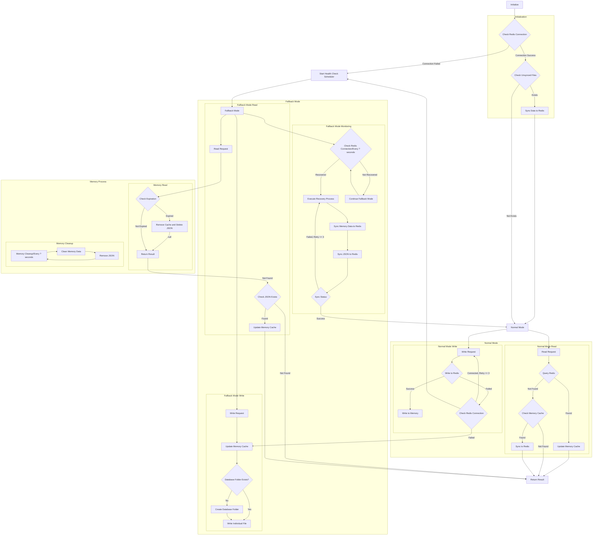

# Redis Fallback

> 一個 Golang Redis 降級方案，當連線不可用時自動降級至本地存儲，並在連線恢復時實現自動復原。<br>
> A Golang Redis fallback solution by automatically downgrades to local storage when connections are unavailable and automatic recovery when connections is reconnected.<br>
>
> 延伸自 [php-redis](https://github.com/pardnchiu/php-redis)、[php-cache-fallback](https://github.com/pardnchiu/php-cache-fallback) 和 [php-session-fallback](https://github.com/pardnchiu/php-session-fallback) 的整合概念<br>
> Extended from the integrated concepts of [php-redis](https://github.com/pardnchiu/php-redis), [php-cache-fallback](https://github.com/pardnchiu/php-cache-fallback), and [php-session-fallback](https://github.com/pardnchiu/php-session-fallback), providing a unified solution.


[](LICENSE)
[](https://github.com/pardnchiu/go-redis-fallback/releases)

## 三大主軸 / Three Core Features

### 三層儲存架構 / Three-Tier Storage
記憶體快取 + Redis + 本地檔案儲存，具備自動容錯機制<br>
Memory cache + Redis + Local file storage with automatic fault tolerance

### 優雅降級並自動復原 / Graceful Degradation and Auto Recovery 
降級時會定期監控 Redis 健康狀態，在連線復原時自動同步資料與清理本地檔案<br>
During degradation, Redis health status is monitored periodically, and automatically syncing data and cleaning local files when connection is reconnected

### 確保資料完整度 / Data Integrity Assurance
回退模式期間將資料儲存為 JSON 檔案以防止遺失，並支援 TTL<br>
Data is stored as JSON files during fallback mode to prevent loss, with TTL support

## 流程圖 / Flow

<details>
<summary>點擊查看</summary>



</details>

## 依賴套件 / Dependencies

- [`github.com/redis/go-redis/v9`](https://github.com/redis/go-redis/v9)
- [`github.com/pardnchiu/go-logger`](https://github.com/pardnchiu/go-logger)<br>
  如果你不需要，你可以 fork 然後使用你熟悉的取代。更可以到[這裡](https://forms.gle/EvNLwzpHfxWR2gmP6)進行投票讓我知道。<br>
  If you don't need this, you can fork the project and replace it. You can also vote [here](https://forms.gle/EvNLwzpHfxWR2gmP6) to let me know your thought.

## 使用方法 / How to use

### 安裝 / Installation
```bash
go get github.com/pardnchiu/go-redis-fallback
```

### 初始化 / Initialization
```go
package main

import (
  "log"
  "time"
  
  rf "github.com/pardnchiu/go-redis-fallback"
)

func main() {
  config := rf.Config{
    Redis: &rf.Redis{
      Host:     "localhost",
      Port:     6379,
      Password: "",
      DB:       0,
    },
  }

  // Initialize
  client, err := rf.New(config)
  if err != nil {
    log.Fatal(err)
  }
  defer client.Close()

  // Store data (with TTL support)
  err = client.Set("user:1", map[string]string{
    "name":  "John",
    "email": "john@example.com",
  }, 5*time.Minute)

  // Get data
  value, err := client.Get("user:1")
  if err == nil {
    log.Printf("Value: %v", value)
  }

  // Delete data
  err = client.Del("user:1")
}
```

## 配置介紹 / Configuration
```go
type Config struct {
  Redis   *Redis   // Redis configuration (required)
  Log     *Log     // Log configuration (optional)
  Options *Options // System parameters and fallback settings (optional)
}

type Redis struct {
  Host     string // Redis server host address (required)
  Port     int    // Redis server port number (required)
  Password string // Redis authentication password (optional, empty means no auth)
  DB       int    // Redis database index (required, usually 0-15)
}

type Log struct {
  Path      string // Log directory path (default: ./logs/redisFallback)
  Stdout    bool   // Enable console log output (default: false)
  MaxSize   int64  // Maximum size before log file rotation (bytes) (default: 16MB)
  MaxBackup int    // Number of rotated log files to retain (default: 5)
  Type      string // Output format: "json" for slog standard, "text" for tree format (default: "text")
}

type Options struct {
  DBPath      string        // File storage path (default: ./files/redisFallback/db)
  MaxRetry    int           // Redis retry count (default: 3)
  MaxQueue    int           // Write queue size (default: 1000)
  TimeToWrite time.Duration // Batch write interval (default: 3 seconds)
  TimeToCheck time.Duration // Health check interval (default: 1 minute)
}
```

## 可用函式 / Functions

### 實例管理 / Instance Management

- **New** - 建立新的實例 / Create new instance
  ```go
  client, err := rf.New(config)
  ```
  - 初始化 Redis 連接<br>
    Initialize Redis connection
  - 設定日誌系統<br>
    Setup logging system
  - 檢查未同步檔案<br>
    Check for unsynced files

- **Close** - 關閉實例 / Close instance
  ```go
  err := client.Close()
  ```
  - 關閉 Redis 連接<br>
    Close Redis connection
  - 清空待處理寫入<br>
    Clear pending writes
  - 釋放系統資源<br>
    Release system resources

### 資料管理

- **Set** - 插入資料 / Insert data<br>
  Redis 失效時自動切換至本地儲存<br>
  Automatically switch to local storage when Redis fails
  ```go
  err := client.Set("key", value, ttl)
  ```

- **Get** - 取得資料 / Get data<br>
  記憶體快取為第一層，Redis 為第二層，本地檔案為回退層<br>
  Memory cache as first layer, Redis as second layer, local files as fallback
  ```go
  value, err := client.Get("key")
  ```

- **Del** - 刪除資料 / Delete data
  ```go
  err := client.Del("key")
  ```

### 儲存模式

- 正常模式 / Normal Mode<br>
  > Redis 可用 / Redis available
  - 優先寫入 Redis <br>
    Write to Redis first
  - 成功後更新記憶體快取<br>
    Update memory cache after success
  - 背景同步確保一致性<br>
    Background sync ensures consistency
    
- 回退模式 / Fallback Mode<br>
  > Redis 無法使用 / Redis unavailable
  - 立即更新記憶體快取<br>
    Immediately update memory cache
  - 將寫入操作加入佇列<br>
    Add write operations to queue
  - 批次寫入本地檔案<br>
    Batch write to local files
  - 監控 Redis 健康狀態<br>
    Monitor Redis health status

### 回退流程 / Fallback

- 健康監控 / Health Monitoring<br>
  > 定期檢查 Redis 連接狀態<br>
  > Periodically check Redis connection status
  - 每 TimeToCheck 間隔自動執行<br>
    Automatically executed every TimeToCheck interval
  - Redis 可用時嘗試復原<br>
    Attempt recovery when Redis is available

- 批次操作 / Batch Operations
  > 回退期間最佳化效能<br>
  > Keeping performance during fallback
  - 在記憶體中將寫入加入佇列<br>
    Queue writes in memory
  - 每 TimeToWrite 間隔批次寫入檔案<br>
    Batch write to files every TimeToWrite interval
  - 復原期間批次同步至 Redis<br>
    Batch sync to Redis during recovery

- 資料持久化
  > 使用 MD5 編碼的分層檔案儲存<br>
  > Layered file storage using MD5 encoding
  - 檔案根據金鑰雜湊儲存在巢狀目錄中<br>
    Files stored in nested directories based on key hash
  - JSON 格式包含中繼資料：金鑰、資料、類型、時間戳、TTL<br>
    JSON format contains metadata: key, data, type, timestamp, TTL

## 檔案儲存結構 / Storage Structure
> 使用 MD5 編碼實現分層目錄<br>
> Using MD5 encoding for layered directories
```
{DBPath}/db/
├── 0/                   # Redis database number
│   ├── ab/              # First 2 characters of MD5
│   │   ├── cd/          # 3rd-4th characters of MD5
│   │   │   ├── ef/      # 5th-6th characters of MD5
│   │   │   │   └── abcdef1234567890abcdef1234567890.json
```

檔案內容格式 / File content format
```json
{
  "key": "original key value",
  "data": "actual stored data",
  "type": "interface {}",
  "timestamp": 1234567890,
  "ttl": 300
}
```

## 功能進度 / Progress
> 持續改進中<br>
> Continuously improving

- 一般操作 / General Operations
  - [x] Get - 取得資料 / Get data
  - [x] Set - 儲存資料 / Store data
  - [x] Del - 刪除金鑰值 / Delete value
  - [ ] Exists - 檢查金鑰是否存在 / Check if key exists
  - [ ] Expire/ExpireAt - 設定過期時間 / Set expiration time
  - [ ] TTL - 取得剩餘存活時間 / Get remaining time to live
  - [ ] Keys - 尋找符合模式的金鑰 / Find keys matching pattern
  - [ ] Scan - 迭代金鑰 / Iterate keys
  - [ ] Pipeline - 批次指令 / Batch commands
  - [ ] TxPipeline - 交易批次 / Transaction batch

- 字串操作 / String Operations
  - [ ] SetNX - 不存在時設定 / Set if not exists
  - [ ] SetEX - 設定並指定過期時間 / Set with expiration
  - [ ] Incr/IncrBy - 遞增數值 / Increment number
  - [ ] Decr/DecrBy - 遞減數值 / Decrement number
  - [ ] MGet/MSet - 批次取得/設定多個金鑰值 / Batch get/set multiple keys

- 雜湊操作 / Hash Operations 
  - [ ] HSet/HGet - 設定/取得雜湊欄位 / Set/get hash field
  - [ ] HGetAll - 取得所有欄位和值 / Get all fields and values
  - [ ] HKeys/HVals - 取得所有欄位名稱/值 / Get all field names/values
  - [ ] HDel - 刪除雜湊欄位 / Delete hash field
  - [ ] HExists - 檢查欄位是否存在 / Check if field exists

- 列表操作 / List Operations
  - [ ] LPush/RPush - 從左側/右側新增元素 / Add elements from left/right
  - [ ] LPop/RPop - 從左側/右側移除元素 / Remove elements from left/right
  - [ ] LRange - 取得範圍元素 / Get range elements
  - [ ] LLen - 取得列表長度 / Get list length

- 集合操作 / Set Operations 
  - [ ] SAdd - 新增元素至集合 / Add element to set
  - [ ] SMembers - 取得所有集合成員 / Get all set members
  - [ ] SRem - 從集合移除元素 / Remove element from set
  - [ ] SCard - 取得集合基數 / Get set cardinality
  - [ ] SIsMember - 檢查元素是否在集合中 / Check if element is in set

### 回退模式無法支援的功能 / Not Supported in Fallback Mode

- 阻塞操作 / Blocking Operations
  - BLPop/BRPop - 阻塞式左側/右側彈出 Blocking left/right pop

- 有序集合操作 / Sorted Set Operations
  - ZAdd - 新增元素至有序集合
  - ZRange/ZRevRange - 依分數取得範圍
  - ZRank/ZRevRank - 取得元素排名
  - ZScore - 取得元素分數
  - ZRem - 移除元素

- 發布/訂閱 / Pub/Sub
  - Publish - 發布訊息 / Publish message
  - Subscribe - 訂閱頻道 / Subscribe to channel

- Lua 腳本 / Lua Scripts
  - Eval/EvalSha - 執行 Lua 腳本 / Execute Lua script

## 授權條款 / License

此原始碼專案採用 [MIT](LICENSE) 授權。<br>
This source code project is licensed under the [MIT](LICENSE) license.

## 作者


<h4 style="padding-top: 0">邱敬幃 Pardn Chiu</h4>

<a href="mailto:dev@pardn.io" target="_blank">
  
</a> <a href="https://linkedin.com/in/pardnchiu" target="_blank">
  
</a>

***

©️ 2025 [邱敬幃 Pardn Chiu](https://pardn.io)