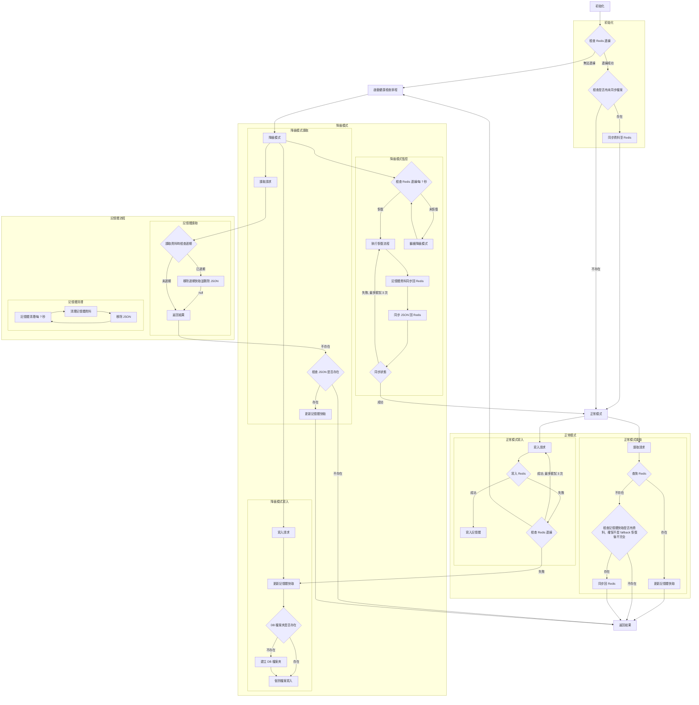

```mermaid
flowchart TD
    A[初始化] --> B{檢查 Redis 連線}
    
    B -->|無法連線| B_0[啟動健康檢查排程]
    B_0 --> B_0_0[降級模式]
    
    subgraph "初始化"
      B -->|連線成功| B_1{檢查是否有未同步檔案}
      B_1 -->|存在| B_1_1[同步資料至 Redis]
    end
    
    subgraph "正常模式"
      
      subgraph "正常模式讀取"
        C --> D{查詢 Redis}
        D -->|存在| D_1[更新記憶體快取]
        D -->|不存在| D_0{檢查記憶體快取是否有資料，確保不是 fallback 恢復後不完全}
        
        D_0 -->|存在| D_0_1[同步回 Redis]
      end
      
      subgraph "正常模式寫入"
        E --> F{寫入 Redis}
        F -->|成功| F_1[寫入記憶體]
        F -->|失敗| F_0{檢查 Redis 連線}

        F_0 -->|成功, 最多嘗試 3 次| E
      end
    end

    D_1 --> ReturnResult[返回結果]
    D_0 -->|不存在| ReturnResult
    D_0_1 --> ReturnResult

    I_0 -->|不存在| ReturnResult[返回 null]
    I_0_1 --> ReturnResult[返回結果]

    B_1_1 --> B_1_0
    B_1 -->|不存在| B_1_0[正常模式]
    B_1_0 --> C[讀取請求]
    B_1_0 --> E[寫入請求]

    F_0 -->|失敗| O
    F_0 --> B_0[啟動健康檢查排程]
    
    B_0_0 --> J{檢查 Redis 連線/每 ? 秒}
    B_0_0 --> N[寫入請求]

    subgraph "降級模式"
      subgraph "降級模式讀取"
    B_0_0 --> H[讀取請求]
        I_0 -->|存在| I_0_1[更新記憶體快取]
      end
      
      subgraph "降級模式監控"
        J -->|恢復| J_1[執行恢復流程]
        J -->|未恢復| J_0[繼續降級模式]
        J_0 --> J

        J_1 --> K[記憶體資料同步回 Redis]
        K --> L[同步 JSON 回 Redis]
        L --> M{同步狀態}
        M -->|失敗, 最多嘗試 3 次| J_1
      end

      subgraph "降級模式寫入"
        N--> O[更新記憶體快取]
        O --> P{DB 檔案夾是否存在}
        P --> |存在| P_1[個別檔案寫入]
        P --> |不存在| P_0[建立 DB 檔案夾]
        P_0 --> P_1
      end
    end
      
    M -->|成功| B_1_0

        H --> Q{查詢記憶體快取}
        S -->|不存在| I_0{檢查 JSON 是否存在}

    subgraph "記憶體流程"

      subgraph "記憶體讀取"
        Q{讀取資料時檢查過期} -->|已過期| Q_1[移除過期快取並刪除 JSON]
        Q_1 --> |null| S
        Q --> |未過期| S[返回結果]
      end 

      subgraph "記憶體清理"
        T[記憶體清理/每 ? 秒] --> U[清理記憶體資料]
        U --> V[移除 JSON]
        V --> T
      end 
    end
```