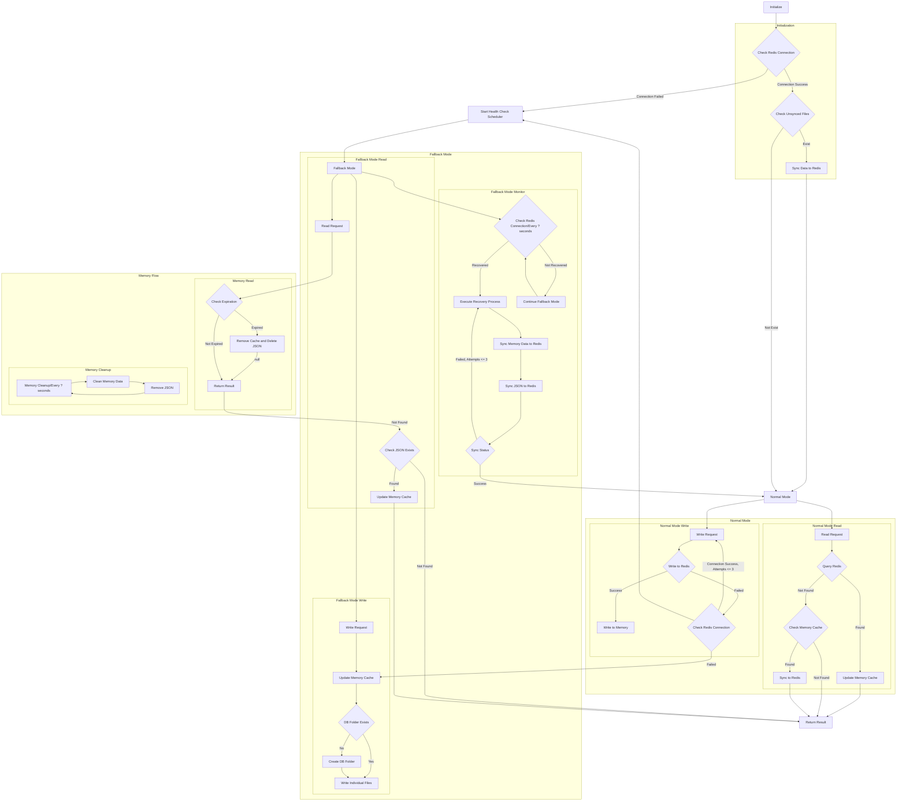

# Redis Fallback (Golang)
A Redis fallback for Golang that automatically degrades to local storage, ensuring minimal data loss during fallback and seamless recovery when Redis becomes available again.

## Key Features

- **Automatic Fallback**: Automatically switches to local file storage when Redis connection fails
- **Automatic Recovery**: Periodically monitors Redis health status and batch synchronizes data after recovery
- **Three-tier Storage Architecture**: Memory cache + Redis + Local file storage
- **Data Persistence**: Stores data as JSON files during fallback mode to prevent data loss
- **Write Queue**: Uses queue and scheduled batch writes to optimize performance in fallback mode
- **TTL Support**: Supports expiration time settings and automatically cleans expired data
- **Layered File Storage**: Uses MD5 encoding to implement layered directory structure avoiding too many files
- **Complete Logging**: Hierarchical logging for monitoring and troubleshooting

## Dependencies

- [github.com/redis/go-redis/v9](https://github.com/redis/go-redis/v9)

## Quick Start

### Installation
```bash
go get github.com/pardnchiu/go-redis-fallback
```

### Basic Usage
```go
package main

import (
  "log"
  "time"
  
  rf "github.com/pardnchiu/go-redis-fallback"
)

func main() {
  // Create configuration
  config := rf.Config{
    Redis: &rf.Redis{
      Host:     "localhost",
      Port:     6379,
      Password: "",
      DB:       0,
    },
    Log: &rf.Log{
      Path:    "./logs/redisFallback",
      Stdout:  true,
      MaxSize: 16 * 1024 * 1024, // 16MB
    },
    Options: &rf.Options{
      DBPath:      "./files/redisFallback/db",
      MaxRetry:    3,
      MaxQueue:    1000,
      TimeToWrite: 3 * time.Second,
      TimeToCheck: 1 * time.Minute,
    },
  }
  
  // Initialize Redis fallback mechanism
  client, err := rf.New(config)
  if err != nil {
    log.Fatal(err)
  }
  defer client.Close()
  
  // Store data (with TTL support)
  err = client.Set("user:1", map[string]string{
    "name":  "John",
    "email": "john@example.com",
  }, 5*time.Minute)
  
  // Get data
  value, err := client.Get("user:1")
  if err == nil {
    log.Printf("Value: %v", value)
  }
  
  // Delete data
  err = client.Del("user:1")
}
```

### Configuration Details

```go
type Config struct {
  Redis *Redis {
    Host     string // Redis host address (default: localhost)
    Port     int    // Redis port (default: 6379)
    Password string // Redis password (optional)
    DB       int    // Redis database number (default: 0)
  }

  Log *Log {
    Path    string // Log file path (default: ./logs/redisFallback)
    Stdout  bool   // Output to stdout (default: false)
    MaxSize int64  // Maximum log file size (default: 16MB)
  }

  Options *Options {
    DBPath      string        // File storage path (default: ./files/redisFallback/db)
    MaxRetry    int           // Redis retry count (default: 3)
    MaxQueue    int           // Write queue size (default: 1000)
    TimeToWrite time.Duration // Batch write interval (default: 3 seconds)
    TimeToCheck time.Duration // Health check interval (default: 1 minute)
  }
}
```

## Core Functions

### Data Access Operations

- **Get** - Retrieve data
  ```go
  value, err := client.Get("key")
  ```
  - Normal mode: Try to get from memory cache, if not found query Redis, update memory cache after success and sync to Redis in background
  - Fallback mode: Read from memory cache, if not found load from local JSON file

- **Set** - Store data
  ```go
  err := client.Set("key", value, ttl)
  ```
  - Normal mode: Write to Redis, update memory cache after success; switch to fallback mode if Redis fails beyond retry limit
  - Fallback mode: Update memory cache, add write requests to queue for batch processing

- **Del** - Delete data
  ```go
  err := client.Del("key")
  ```
  - Remove data from memory cache, Redis and local files simultaneously
  - In fallback mode only remove from memory cache and local files

### Fallback and Recovery Mechanism

#### Automatic Fallback Triggers
- Initial Redis connection failure
- Set operation retry count exceeds limit
- Get operation Redis read failure exceeds retry count

#### Fallback Mode Operation
- Start scheduled health checks (default every minute)
- Write operations use queue for temporary storage
- Scheduled batch writes to local files (default every 3 seconds)

#### Automatic Recovery Process
1. Health check detects Redis availability
2. Stop health check scheduler
3. Scan local files and load to memory
4. Batch sync memory data to Redis (commit every 100 records)
5. Clean local files and empty directories
6. Switch back to normal mode

### File Storage Structure

Uses MD5 encoding to implement layered directories, avoiding too many files in a single directory:

```
{filepath}/db/
├── 0/                   # Redis DB
│   ├── ab/              # First 2 chars of MD5
│   │   ├── cd/          # 3rd-4th chars of MD5
│   │   │   ├── ef/      # 5th-6th chars of MD5
│   │   │   │   └── abcdef1234567890abcdef1234567890.json
```

File content format:
```json
{
  "key": "original key value",
  "data": "actual stored data",
  "type": "interface {}",
  "timestamp": 1234567890,
  "ttl": 300
}
```

### Expiration Management

- **Read-time Check**: Every Get operation checks if data is expired
- **Background Cleanup**: Clean expired data from memory every 30 seconds
- **File Cleanup**: Expired data is removed from both memory and local files
- **TTL Calculation**: Based on timestamp + ttl to determine expiration status

### Write Optimization Strategy

#### Normal Mode
- Write directly to Redis, update memory cache after success

#### Fallback Mode
- Update memory cache immediately to ensure read consistency
- Add write requests to queue (non-blocking)
- Write directly to file when queue is full
- Process write requests in queue with scheduled batch processing

## Concurrency Safety

- **Read-Write Lock**: Protects health status changes
- **sync.Map**: Concurrent-safe memory cache
- **Atomic Operations**: Prevents duplicate recovery process execution
- **Channel Queue**: Concurrent processing of write requests
- **Mutex Lock**: Synchronization of write queue and local file operations

## Error Handling Strategy

- **Retry Mechanism**: Automatic retry on Redis operation failure (configurable count)
- **Graceful Fallback**: Automatically switch to local storage when Redis is unavailable
- **Error Logging**: Complete error logging for troubleshooting
- **Data Consistency**: Ensure data synchronization between memory, Redis and files

## Performance Characteristics

- **Memory First**: Prioritize reading data from memory cache
- **Batch Operations**: Use Pipeline for batch sync to Redis during recovery
- **File Layering**: Avoid too many files in single directory affecting performance
- **Non-blocking Queue**: Write operations don't block main flow
- **Scheduled Cleanup**: Automatically clean expired data to free memory

## Flow Chart



## Feature Progress
> Continuous improvement
- **General Operations**
  - [x] Get - Retrieve data
  - [x] Set - Store data
  - [x] Del - Delete key-value
  - [ ] Exists - Check if key exists
  - [ ] Expire/ExpireAt - Set expiration time
  - [ ] TTL - Get remaining time to live
  - [ ] Keys - Find keys matching pattern
  - [ ] Scan - Iterate keys
  - [ ] Pipeline - Batch commands
  - [ ] TxPipeline - Transaction batch
- **String Operations**
  - [ ] SetNX - Set if not exists
  - [ ] SetEX - Set with expiration time
  - [ ] Incr/IncrBy - Increment numeric value
  - [ ] Decr/DecrBy - Decrement numeric value
  - [ ] MGet/MSet - Batch get/set multiple key-value pairs
- **Hash Operations**
  - [ ] HSet/HGet - Set/get hash field
  - [ ] HGetAll - Get all fields and values
  - [ ] HKeys/HVals - Get all field names/values
  - [ ] HDel - Delete hash field
  - [ ] HExists - Check if field exists
- **List Operations**
  - [ ] LPush/RPush - Add elements from left/right
  - [ ] LPop/RPop - Remove elements from left/right
  - [ ] LRange - Get range elements
  - [ ] LLen - Get list length
- **Set Operations**
  - [ ] SAdd - Add element to set
  - [ ] SMembers - Get all set members
  - [ ] SRem - Remove element from set
  - [ ] SCard - Get set cardinality
  - [ ] SIsMember - Check if element is in set

### Can not be supported at fallback mode
- **List Operations**
  - BLPop/BRPop - Blocking left/right pop
- **Sorted Set Operations**
  - ZAdd - Add element to sorted set
  - ZRange/ZRevRange - Get range by score
  - ZRank/ZRevRank - Get element rank<
  - ZScore - Get element score
  - ZRem - Remove element
- **Pub/Sub**
  - Publish - Publish message
  - Subscribe - Subscribe to channel
- **Lua Scripts**
  - Eval/EvalSha - Execute Lua script

## License

This source code project is licensed under the [MIT](https://github.com/pardnchiu/FlexPlyr/blob/main/LICENSE) license.

## Creator


<h4 style="padding-top: 0">邱敬幃 Pardn Chiu</h4>

<a href="mailto:dev@pardn.io" target="_blank">
    
</a> <a href="https://linkedin.com/in/pardnchiu" target="_blank">
    
</a>

***

©️ 2025 [邱敬幃 Pardn Chiu](https://pardn.io)