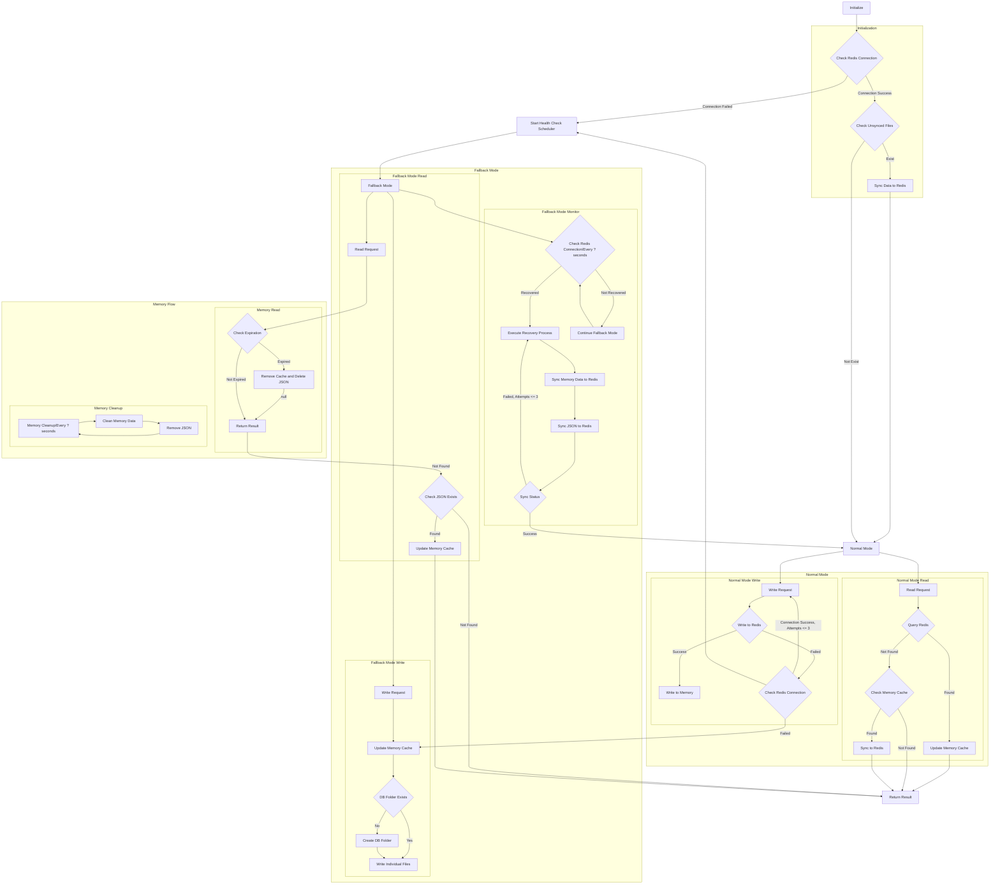

# Redis Fallback (Golang)

> A Redis fallback package that automatically degrades to local storage, ensuring minimal data loss during fallback and seamless recovery when Redis becomes available again.<br>
> Extended from the integration concept of [php-redis](https://github.com/pardnchiu/php-redis), [php-cookie-fallback](https://github.com/pardnchiu/php-cookie-fallback), and [php-session-fallback](https://github.com/pardnchiu/php-session-fallback), providing a unified solution for Golang.

[](https://github.com/pardnchiu/go-redis-fallback/blob/main/LICENSE)
[](https://github.com/pardnchiu/go-redis-fallback/releases)
[](https://github.com/pardnchiu/go-redis-fallback/blob/main/README.zh.md)

## Three key features

- **Three-tier Storage Architecture**: Memory cache + Redis + Local file storage with automatic fallback
- **Automatic Recovery**: Periodically monitors Redis health status and batch synchronizes data after recovery
- **Data Persistence**: Stores data as JSON files during fallback mode to prevent data loss with TTL support

## Flow

<details>
<summary>Click to show</summary>



</details>

## Dependencies

- [`github.com/redis/go-redis/v9`](https://github.com/redis/go-redis/v9)
- [`github.com/pardnchiu/go-logger`](https://github.com/pardnchiu/go-logger)

## How to use

### Installation
```bash
go get github.com/pardnchiu/go-redis-fallback
```

### Initialization
```go
package main

import (
  "log"
  "time"
  
  rf "github.com/pardnchiu/go-redis-fallback"
)

func main() {
  // Minimal configuration
  config := rf.Config{
    Redis: &rf.Redis{
      Host:     "localhost",
      Port:     6379,
      Password: "",
      DB:       0,
    },
  }

  // Initialize Redis fallback mechanism
  client, err := rf.New(config)
  if err != nil {
    log.Fatal(err)
  }
  defer client.Close()

  // Store data (with TTL support)
  err = client.Set("user:1", map[string]string{
    "name":  "John",
    "email": "john@example.com",
  }, 5*time.Minute)

  // Get data
  value, err := client.Get("user:1")
  if err == nil {
    log.Printf("Value: %v", value)
  }

  // Delete data
  err = client.Del("user:1")
}
```

### Configuration Details

```go
type Config struct {
  Redis   *Redis   // Redis configuration (required)
  Log     *Log     // Logging configuration (optional)
  Options *Options // System parameters and fallback settings (optional)
}

type Redis struct {
  Host     string // Redis server host address (required)
  Port     int    // Redis server port number (required)
  Password string // Redis authentication password (optional, empty for no auth)
  DB       int    // Redis database index (required, typically 0-15)
}

type Log struct {
  Path      string // Log directory path (default: ./logs/redisFallback)
  Stdout    bool   // Enable console output logging (default: false)
  MaxSize   int64  // Maximum log file size before rotation in bytes (default: 16MB)
  MaxBackup int    // Number of rotated log files to retain (default: 5)
  Type      string // Output format: "json" for slog standard, "text" for tree format (default: "text")
}

type Options struct {
  DBPath      string        // File storage path (default: ./files/redisFallback/db)
  MaxRetry    int           // Redis retry count (default: 3)
  MaxQueue    int           // Write queue size (default: 1000)
  TimeToWrite time.Duration // Batch write interval (default: 3 seconds)
  TimeToCheck time.Duration // Health check interval (default: 1 minute)
}
```

## Supported Operations

### Core Methods

```go
// Store data with optional TTL
err := client.Set("key", value, ttl)

// Retrieve data
value, err := client.Get("key")

// Delete data
err := client.Del("key")

// Close client and cleanup resources
err := client.Close()
```

### Storage Modes

```go
// Normal Mode - Redis available
// 1. Write to Redis first
// 2. Update memory cache on success
// 3. Background sync for consistency

// Fallback Mode - Redis unavailable
// 1. Update memory cache immediately
// 2. Queue write operations
// 3. Batch write to local files
// 4. Monitor Redis health
```

## Core Features

### Connection Management

- **New** - Create new Redis fallback client
  ```go
  client, err := rf.New(config)
  ```
  - Initialize Redis connection
  - Setup logging system
  - Check for unsynced files
  - Start in appropriate mode

- **Close** - Close Redis fallback client
  ```go
  err := client.Close()
  ```
  - Close Redis connection
  - Flush pending writes
  - Release system resources

### Storage Features

- **Three-tier Architecture** - Memory cache as first layer, Redis as second, local files as fallback
  ```go
  value, err := client.Get("key") // Checks memory → Redis → local files
  ```

- **Automatic Fallback** - Seamlessly switch to local storage when Redis fails
  ```go
  err := client.Set("key", value, ttl) // Falls back to local storage on Redis failure
  ```

- **Smart Recovery** - Batch synchronize data when Redis becomes available
  ```go
  // Automatically triggered during health checks
  // Syncs memory and file data back to Redis
  ```

### Fallback Flow

- **Health Monitoring** - Periodic Redis connection checks
  ```go
  // Automatically runs every TimeToCheck interval
  // Attempts recovery when Redis is available
  ```

- **Batch Operations** - Optimize performance during fallback
  ```go
  // Queue writes in memory
  // Batch write to files every TimeToWrite interval
  // Batch sync to Redis during recovery
  ```

- **Data Persistence** - Layered file storage with MD5 encoding
  ```go
  // Files stored in nested directories based on key hash
  // JSON format with metadata: key, data, type, timestamp, ttl
  ```

## Security Features

- **Data Integrity**: Consistent data across memory, Redis, and local storage
- **Atomic Operations**: Prevent data corruption during mode transitions
- **TTL Management**: Automatic expiration handling across all storage layers
- **Layered Structure**: MD5-based directory structure prevents filesystem bottlenecks
- **Concurrency Safety**: Thread-safe operations with proper locking mechanisms

## File Storage Structure

Uses MD5 encoding to implement layered directories:

```
{DBPath}/db/
├── 0/                   # Redis DB number
│   ├── ab/              # First 2 chars of MD5
│   │   ├── cd/          # 3rd-4th chars of MD5
│   │   │   ├── ef/      # 5th-6th chars of MD5
│   │   │   │   └── abcdef1234567890abcdef1234567890.json
```

File content format:
```json
{
  "key": "original key value",
  "data": "actual stored data",
  "type": "interface {}",
  "timestamp": 1234567890,
  "ttl": 300
}
```

## Feature Progress

> Continuous improvement

- **General Operations**
  - [x] Get - Retrieve data
  - [x] Set - Store data
  - [x] Del - Delete key-value
  - [ ] Exists - Check if key exists
  - [ ] Expire/ExpireAt - Set expiration time
  - [ ] TTL - Get remaining time to live
  - [ ] Keys - Find keys matching pattern
  - [ ] Scan - Iterate keys
  - [ ] Pipeline - Batch commands
  - [ ] TxPipeline - Transaction batch

- **String Operations**
  - [ ] SetNX - Set if not exists
  - [ ] SetEX - Set with expiration time
  - [ ] Incr/IncrBy - Increment numeric value
  - [ ] Decr/DecrBy - Decrement numeric value
  - [ ] MGet/MSet - Batch get/set multiple key-value pairs

- **Hash Operations**
  - [ ] HSet/HGet - Set/get hash field
  - [ ] HGetAll - Get all fields and values
  - [ ] HKeys/HVals - Get all field names/values
  - [ ] HDel - Delete hash field
  - [ ] HExists - Check if field exists

- **List Operations**
  - [ ] LPush/RPush - Add elements from left/right
  - [ ] LPop/RPop - Remove elements from left/right
  - [ ] LRange - Get range elements
  - [ ] LLen - Get list length

- **Set Operations**
  - [ ] SAdd - Add element to set
  - [ ] SMembers - Get all set members
  - [ ] SRem - Remove element from set
  - [ ] SCard - Get set cardinality
  - [ ] SIsMember - Check if element is in set

### Cannot be supported in fallback mode

- **Blocking Operations**
  - BLPop/BRPop - Blocking left/right pop

- **Sorted Set Operations**
  - ZAdd - Add element to sorted set
  - ZRange/ZRevRange - Get range by score
  - ZRank/ZRevRank - Get element rank
  - ZScore - Get element score
  - ZRem - Remove element

- **Pub/Sub**
  - Publish - Publish message
  - Subscribe - Subscribe to channel

- **Lua Scripts**
  - Eval/EvalSha - Execute Lua script

## License

This source code project is licensed under the [MIT](https://github.com/pardnchiu/go-redis-fallback/blob/main/LICENSE) License.

## Author


<h4 style="padding-top: 0">邱敬幃 Pardn Chiu</h4>

<a href="mailto:dev@pardn.io" target="_blank">
  
</a> <a href="https://linkedin.com/in/pardnchiu" target="_blank">
  
</a>

***

©️ 2025 [邱敬幃 Pardn Chiu](https://pardn.io)