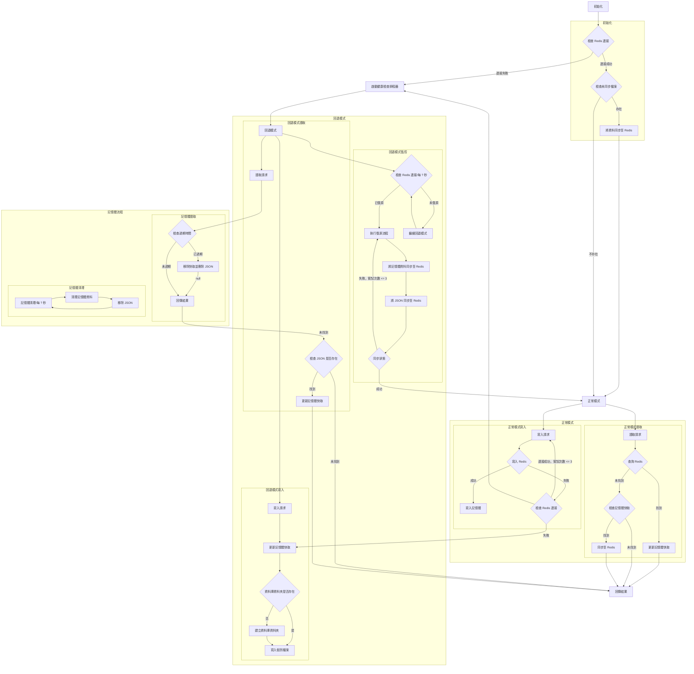

# Redis Fallback (Golang)

> 一個 Redis 容錯套件，當 Redis 不可用時自動降級至本地存儲，確保回退期間的最小資料遺失，並在 Redis 恢復可用時實現無縫復原。<br>
> 延伸自 [php-redis](https://github.com/pardnchiu/php-redis)、[php-cookie-fallback](https://github.com/pardnchiu/php-cookie-fallback) 和 [php-session-fallback](https://github.com/pardnchiu/php-session-fallback) 的整合概念，為 Golang 提供統一解決方案。

[](https://github.com/pardnchiu/go-redis-fallback/blob/main/LICENSE)
[](https://github.com/pardnchiu/go-redis-fallback/releases)
[](https://github.com/pardnchiu/go-redis-fallback/blob/main/README.md)

## 三大主軸

- **三層儲存架構**：記憶體快取 + Redis + 本地檔案儲存，具備自動容錯機制
- **自動復原**：定期監控 Redis 健康狀態，復原後批次同步資料
- **資料持久化**：回退模式期間將資料儲存為 JSON 檔案以防止遺失，支援 TTL

## 流程圖

<details>
<summary>點擊查看</summary>



</details>

## 相依套件

- [`github.com/redis/go-redis/v9`](https://github.com/redis/go-redis/v9)
- [`github.com/pardnchiu/go-logger`](https://github.com/pardnchiu/go-logger)

## 使用方法

### 安裝
```bash
go get github.com/pardnchiu/go-redis-fallback
```

### 初始化
```go
package main

import (
  "log"
  "time"
  
  rf "github.com/pardnchiu/go-redis-fallback"
)

func main() {
  // 最小配置
  config := rf.Config{
    Redis: &rf.Redis{
      Host:     "localhost",
      Port:     6379,
      Password: "",
      DB:       0,
    },
  }

  // 初始化 Redis 容錯機制
  client, err := rf.New(config)
  if err != nil {
    log.Fatal(err)
  }
  defer client.Close()

  // 儲存資料（支援 TTL）
  err = client.Set("user:1", map[string]string{
    "name":  "John",
    "email": "john@example.com",
  }, 5*time.Minute)

  // 取得資料
  value, err := client.Get("user:1")
  if err == nil {
    log.Printf("數值: %v", value)
  }

  // 刪除資料
  err = client.Del("user:1")
}
```

### 配置詳細說明

```go
type Config struct {
  Redis   *Redis   // Redis 配置（必填）
  Log     *Log     // 日誌配置（選填）
  Options *Options // 系統參數和回退設定（選填）
}

type Redis struct {
  Host     string // Redis 伺服器主機位址（必填）
  Port     int    // Redis 伺服器連接埠號（必填）
  Password string // Redis 驗證密碼（選填，空值表示無需驗證）
  DB       int    // Redis 資料庫索引（必填，通常為 0-15）
}

type Log struct {
  Path      string // 日誌目錄路徑（預設：./logs/redisFallback）
  Stdout    bool   // 啟用控制台輸出日誌（預設：false）
  MaxSize   int64  // 日誌檔案輪替前的最大大小（位元組）（預設：16MB）
  MaxBackup int    // 保留的輪替日誌檔案數量（預設：5）
  Type      string // 輸出格式："json" 為 slog 標準，"text" 為樹狀格式（預設："text"）
}

type Options struct {
  DBPath      string        // 檔案儲存路徑（預設：./files/redisFallback/db）
  MaxRetry    int           // Redis 重試次數（預設：3）
  MaxQueue    int           // 寫入佇列大小（預設：1000）
  TimeToWrite time.Duration // 批次寫入間隔（預設：3 秒）
  TimeToCheck time.Duration // 健康檢查間隔（預設：1 分鐘）
}
```

## 支援的操作

### 核心方法

```go
// 儲存資料（可選 TTL）
err := client.Set("key", value, ttl)

// 取得資料
value, err := client.Get("key")

// 刪除資料
err := client.Del("key")

// 關閉客戶端並清理資源
err := client.Close()
```

### 儲存模式

```go
// 正常模式 - Redis 可用
// 1. 優先寫入 Redis
// 2. 成功後更新記憶體快取
// 3. 背景同步確保一致性

// 回退模式 - Redis 無法使用
// 1. 立即更新記憶體快取
// 2. 將寫入操作加入佇列
// 3. 批次寫入本地檔案
// 4. 監控 Redis 健康狀態
```

## 核心功能

### 連接管理

- **New** - 建立新的 Redis 容錯客戶端
  ```go
  client, err := rf.New(config)
  ```
  - 初始化 Redis 連接
  - 設定日誌系統
  - 檢查未同步檔案
  - 以適當模式啟動

- **Close** - 關閉 Redis 容錯客戶端
  ```go
  err := client.Close()
  ```
  - 關閉 Redis 連接
  - 清空待處理寫入
  - 釋放系統資源

### 儲存功能

- **三層架構** - 記憶體快取為第一層，Redis 為第二層，本地檔案為回退層
  ```go
  value, err := client.Get("key") // 檢查記憶體 → Redis → 本地檔案
  ```

- **自動回退** - Redis 失效時無縫切換至本地儲存
  ```go
  err := client.Set("key", value, ttl) // Redis 失效時回退至本地儲存
  ```

- **智慧復原** - Redis 恢復可用時批次同步資料
  ```go
  // 健康檢查期間自動觸發
  // 將記憶體和檔案資料同步回 Redis
  ```

### 回退流程

- **健康監控** - 定期檢查 Redis 連接狀態
  ```go
  // 每 TimeToCheck 間隔自動執行
  // Redis 可用時嘗試復原
  ```

- **批次操作** - 回退期間最佳化效能
  ```go
  // 在記憶體中將寫入加入佇列
  // 每 TimeToWrite 間隔批次寫入檔案
  // 復原期間批次同步至 Redis
  ```

- **資料持久化** - 使用 MD5 編碼的分層檔案儲存
  ```go
  // 檔案根據金鑰雜湊儲存在巢狀目錄中
  // JSON 格式包含中繼資料：金鑰、資料、類型、時間戳、TTL
  ```

## 安全功能

- **資料完整性**：記憶體、Redis 和本地儲存間的資料一致性
- **原子操作**：防止模式切換期間的資料損壞
- **TTL 管理**：所有儲存層的自動過期處理
- **分層結構**：基於 MD5 的目錄結構防止檔案系統瓶頸
- **並發安全**：具備適當鎖定機制的執行緒安全操作

## 檔案儲存結構

使用 MD5 編碼實現分層目錄：

```
{DBPath}/db/
├── 0/                   # Redis 資料庫編號
│   ├── ab/              # MD5 前 2 個字元
│   │   ├── cd/          # MD5 第 3-4 個字元
│   │   │   ├── ef/      # MD5 第 5-6 個字元
│   │   │   │   └── abcdef1234567890abcdef1234567890.json
```

檔案內容格式：
```json
{
  "key": "原始金鑰值",
  "data": "實際儲存資料",
  "type": "interface {}",
  "timestamp": 1234567890,
  "ttl": 300
}
```

## 功能進度

> 持續改進中

- **一般操作**
  - [x] Get - 取得資料
  - [x] Set - 儲存資料
  - [x] Del - 刪除金鑰值
  - [ ] Exists - 檢查金鑰是否存在
  - [ ] Expire/ExpireAt - 設定過期時間
  - [ ] TTL - 取得剩餘存活時間
  - [ ] Keys - 尋找符合模式的金鑰
  - [ ] Scan - 迭代金鑰
  - [ ] Pipeline - 批次指令
  - [ ] TxPipeline - 交易批次

- **字串操作**
  - [ ] SetNX - 不存在時設定
  - [ ] SetEX - 設定並指定過期時間
  - [ ] Incr/IncrBy - 遞增數值
  - [ ] Decr/DecrBy - 遞減數值
  - [ ] MGet/MSet - 批次取得/設定多個金鑰值

- **雜湊操作**
  - [ ] HSet/HGet - 設定/取得雜湊欄位
  - [ ] HGetAll - 取得所有欄位和值
  - [ ] HKeys/HVals - 取得所有欄位名稱/值
  - [ ] HDel - 刪除雜湊欄位
  - [ ] HExists - 檢查欄位是否存在

- **列表操作**
  - [ ] LPush/RPush - 從左側/右側新增元素
  - [ ] LPop/RPop - 從左側/右側移除元素
  - [ ] LRange - 取得範圍元素
  - [ ] LLen - 取得列表長度

- **集合操作**
  - [ ] SAdd - 新增元素至集合
  - [ ] SMembers - 取得所有集合成員
  - [ ] SRem - 從集合移除元素
  - [ ] SCard - 取得集合基數
  - [ ] SIsMember - 檢查元素是否在集合中

### 回退模式無法支援的功能

- **阻塞操作**
  - BLPop/BRPop - 阻塞式左側/右側彈出

- **有序集合操作**
  - ZAdd - 新增元素至有序集合
  - ZRange/ZRevRange - 依分數取得範圍
  - ZRank/ZRevRank - 取得元素排名
  - ZScore - 取得元素分數
  - ZRem - 移除元素

- **發布/訂閱**
  - Publish - 發布訊息
  - Subscribe - 訂閱頻道

- **Lua 腳本**
  - Eval/EvalSha - 執行 Lua 腳本

## 授權條款

此原始碼專案採用 [MIT](https://github.com/pardnchiu/go-redis-fallback/blob/main/LICENSE) 授權。

## 作者


<h4 style="padding-top: 0">邱敬幃 Pardn Chiu</h4>

<a href="mailto:dev@pardn.io" target="_blank">
  
</a> <a href="https://linkedin.com/in/pardnchiu" target="_blank">
  
</a>

***

©️ 2025 [邱敬幃 Pardn Chiu](https://pardn.io)